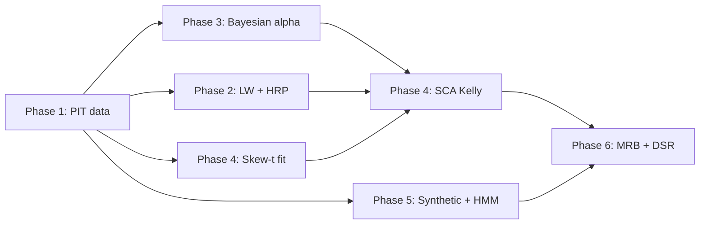

# Inversiones_mama v2 — Thousand-Stock Equities Architecture

> ## AMENDMENT — 2026-04-22: ZERO-BUDGET DEPLOYMENT PLAN (authoritative)
>
> This section **supersedes** the parts of the original mandate below
> that assumed paid data vendors and a 3,000-stock universe. The
> corrected scope is:
>
> **Phase A — Immediate action:** deploy v1a to IBKR **paper** with
> full execution instrumentation. The trade log + paper orchestrator
> are implemented (`execution/trade_log.py`, `execution/paper_trader.py`,
> `scripts/run_paper_rebalance.py`). Use the `DryRunClient` until Agent 3
> commits the live IBKR Client Portal adapter; then swap in the real
> client behind the `ExecutionClient` Protocol.
>
> **Phase B — Parallel v2 development on FREE data only:**
>
> * **Universe reduction to 50–150 liquid assets** — NOT "thousands".
>   See `data/liquid_universe.py` (`SP100_CORE`, `NASDAQ100_CORE`,
>   `LIQUID_ETFS`). Sized to fit the AlphaVantage 25/day and Finnhub
>   60/min free-tier caps.
> * **Fake point-in-time fundamentals via delayed-report** — see
>   `data/delayed_fundamentals.py` (`DelayedFundamentalsLoader`,
>   `DELAY_90D`). Canonical 90-day release-to-usable lag removes
>   lookahead bias without paid PIT data. Limitations are documented
>   in the module (restatements invisible; constituency still needs
>   a separate PIT source).
> * **No paid data vendors** until paper trading validates that the
>   live strategy matches the backtest assumptions.
>
> **Explicitly forbidden at this stage:**
>
> * Purchasing Sharadar or any PIT data vendor.
> * Upgrading Finnhub / AlphaVantage tiers.
> * Expanding the universe beyond the curated 50–150 liquid names.
> * Finalizing production storage architecture.
>
> **Phase C — Deferred:** paid PIT data, API upgrades, universe
> expansion. These decisions only unblock AFTER 2–4 weeks of
> continuous paper trading with stable execution and slippage inside
> the IBKR Tiered cost model baseline.
>
> **Phase-level ownership under zero-budget:**
> Phase 1 (PIT heuristic) and the execution-instrumentation work
> (Phases A) are Agent 1; Phase 2 (HRP + shrinkage) remains Agent 2;
> live IBKR wiring is Agent 3. The deeper Phases 3–6 of the original
> mandate below are **on hold** pending paper-trading results.
>
> ## Primary acceptance gate for the zero-budget window
>
> Before any paid data is purchased, the following must hold:
>
> * Paper trading runs ≥ 2 weeks with no structural failures.
> * Live slippage distribution matches the IBKR Tiered cost model
>   baked into `backtest/costs.py` within 20 bps at the 95th percentile.
> * Fill rate ≥ 95% on a standard rebalance.
> * No critical bugs in the execution pipeline.
>
> ## Original mandate (retained for reference)
>
> **Status:** mandate issued 2026-04-22 by Jorge. v1a (10-ETF) is shipped
> and passes all sanity gates (see `results/v1a_verdict.txt`). v2 is a
> fundamental scope expansion — NOT a refactor of v1a — targeting
> idiosyncratic alpha on thousands of individual equities.
>
> **Owning agents:**
> - **Agent 1 (Data & Alpha):** Phases 1, 3, 4-data, 5, 6-metrics.
> - **Agent 2 (Risk & Execution):** Phases 2, 4-optimizer, 6-execution.
> - **Agent 3 (IBKR pipeline):** Live-data and execution wiring (already in flight).

---

## 0. Why v2

v1a delivered a working 10-ETF factor-tilted Kelly portfolio that:

- Passes every sanity gate (turnover, drawdown, loss-probability, RCK bound).
- Produces a **5.8% CAGR** over 5 years — a defensive, low-volatility anchor.
- Reports **full-sample Deflated Sharpe = 0.009** — statistically
  indistinguishable from noise once we correct for multiple testing and
  the +7.2 excess kurtosis in the return distribution.

For a $5,000 high-risk-mandate block, this is not the right tool. The
10-ETF universe's long-only + Kelly-0.65 + 35%-cap structure makes it
fundamentally a diversified market proxy, not an alpha engine. To
generate materially higher CAGR without abandoning the safety framework,
we must exploit idiosyncratic equity mispricing — which requires scaling
to the full US equity universe.

**Target metrics for v2 (clear v1a before shipping v2):**

| Metric                      | v1a observed   | v2 target   |
|-----------------------------|----------------|-------------|
| CAGR (OOS)                  | 4.9%           | ≥ 15%       |
| Sharpe (OOS)                | +1.49          | ≥ 1.0       |
| Deflated Sharpe (MRB-wide)  | 0.009          | ≥ 0.95      |
| Max DD (MC, p95)            | 13.2%          | < 40%       |
| P(loss > 40%)               | 0%             | < 30%       |
| Annual turnover cost        | 0.27%          | < 2.0%      |

---

## 1. Phase 1 — Point-in-Time Data Integrity  [Agent 1]

**Goal:** Build a survivorship-bias-free universe with fundamentals and
corporate actions, at daily granularity, across ≥ 3,000 US equities for
the full 2015–2026 window.

### Deliverables

| File                                  | Purpose                                                                                     |
|---------------------------------------|---------------------------------------------------------------------------------------------|
| `src/inversiones_mama/data/universe.py`      | `PointInTimeUniverse` — constituents as of any date. No forward-peek. |
| `src/inversiones_mama/data/fundamentals.py`  | Finnhub + AlphaVantage fundamentals loader with parquet cache. |
| `src/inversiones_mama/data/corporate_actions.py` | Splits, mergers, delistings, dividend adjustments. |
| `src/inversiones_mama/data/outliers.py`      | Winsorization (1% / 99%), robust z-score, trimming. |
| `src/inversiones_mama/data/panel.py`         | Cross-section panel loader — (date, ticker) -> {price, fundamentals}. |

### Data sources (requires vendor decisions)

- **Point-in-time constituent lists:** yfinance does NOT provide these.
  Options:
  - **Sharadar Core US Fundamentals** (~$120/mo) — includes full point-in-time universe.
  - **CRSP** (requires institutional access).
  - **Finnhub Premium** historical index constituents (less reliable; verify coverage).
  - **Fallback:** reconstruct from monthly S&P / Russell index reconstitution press releases.
- **Fundamentals:** Finnhub free-trial key is already in `.env`; Pro
  upgrade needed for 30-year history. AlphaVantage supplements.
- **Corporate actions:** Most sources include; need de-dup and validation.

### Acceptance criteria

1. **Survivorship test:** backtest PASSES must not improve when run on
   current-constituents-only vs. point-in-time; if current-only produces a
   measurably higher Sharpe, bias is leaking.
2. **Coverage:** ≥ 2,500 unique tickers per month, 2018-01 onwards.
3. **Delisting events:** at least 150 delistings captured over 2018–2026
   (empirically that's the ballpark).
4. **No forward-peek:** `PointInTimeUniverse.members_on(date)` must only
   use information knowable at `date`.

### Interfaces to scaffold this session

```python
# data/universe.py  (stub now, wire to vendor later)
class PointInTimeUniverse:
    def members_on(self, as_of: pd.Timestamp) -> list[str]: ...
    def active_range(self, ticker: str) -> tuple[pd.Timestamp, pd.Timestamp]: ...
    def all_tickers(self) -> list[str]: ...

# data/fundamentals.py
class FundamentalsLoader:
    def load_as_of(self, ticker: str, as_of: pd.Timestamp) -> pd.Series: ...
    def load_panel(self, tickers: list[str], start: datetime, end: datetime) -> pd.DataFrame: ...
```

---

## 2. Phase 2 — High-Dimensional Covariance  [Agent 2]

**Goal:** Estimate a usable covariance structure on `N ≈ 3,000` assets
without inverting the raw sample covariance (which is singular when
`T < N(N+1)/2` — always, at daily granularity).

### Deliverables

| File                                            | Purpose                                                  |
|-------------------------------------------------|----------------------------------------------------------|
| `src/inversiones_mama/models/covariance.py`     | Ledoit-Wolf shrinkage + factor-model targets.            |
| `src/inversiones_mama/models/cluster.py`        | Agglomerative hierarchical clustering with `d_ij = sqrt(0.5 * (1 - rho_ij))`. |
| `src/inversiones_mama/sizing/hrp.py`            | Hierarchical Risk Parity — no Σ⁻¹.                       |

### Key algorithms

- **Ledoit-Wolf shrinkage:** `Sigma_hat = (1 - delta) * S + delta * F`
  where `S` is sample, `F` is structured target (constant correlation or
  factor model), and `delta` minimizes expected Frobenius distance.
- **HRP (López de Prado 2016):**
  1. Compute correlation matrix, convert to distance `d_ij = sqrt(0.5 * (1 - rho_ij))`.
  2. Agglomerative clustering (Ward or single-linkage).
  3. Quasi-diagonalize the covariance matrix by reordering.
  4. Recursive bisection: allocate inversely proportional to cluster variance.
- **Factor risk model:** decompose `Sigma = B Λ B^T + Psi` where B is
  factor loadings, Λ is factor covariance, Ψ is diagonal idiosyncratic.

### Acceptance criteria

1. Ledoit-Wolf `Sigma_hat` condition number < 10³ even with `N = 3,000`.
2. HRP portfolio weights sum to 1, all non-negative, per-name cap applied.
3. HRP runs end-to-end on `N = 3,000` in < 60 seconds on a laptop.
4. Unit test: on a synthetic factor-structured covariance, Ledoit-Wolf
   recovers the population cov within 10% Frobenius error with `T = N/2`.

---

## 3. Phase 3 — Bayesian Alpha Generation  [Agent 1]

**Goal:** Produce `mu_i` forecasts for every stock with explicit
uncertainty (not a point estimate) using fundamentals as features.

### Deliverables

| File                                                  | Purpose                                              |
|-------------------------------------------------------|------------------------------------------------------|
| `src/inversiones_mama/models/bayesian_alpha.py`       | BLR-ARD + NUTS sampler via NumPyro or PyMC.          |
| `src/inversiones_mama/models/black_litterman.py`      | Black-Litterman integration with posterior views.   |

### Pipeline

1. **Feature engineering:** value (P/B, EV/EBITDA), quality (ROE, debt/equity),
   momentum (12-1 momentum), growth (revenue CAGR), volatility (realized vol).
2. **Training:** cross-section regression of next-month return on features.
   Model: `r_{i,t+1} ~ Normal(X_{i,t} @ beta, sigma)` with ARD prior on `beta`:
   `beta_k ~ Normal(0, tau_k)`, `tau_k ~ HalfCauchy(0, 1)`.
3. **Sampling:** NUTS (No-U-Turn Sampler) for 4 chains × 1,000 samples each.
4. **Posterior views:** for each stock, posterior mean of `r_{i,t+1}` becomes
   the view `q_i`; posterior variance populates `Omega_i` in Black-Litterman.

### Acceptance criteria

1. Posterior predictive check: coverage of 50% credible interval ≥ 45%.
2. ARD prior shrinks at least 30% of feature weights to < 0.01 magnitude
   (no uniform feature attention).
3. Runs on `N = 3,000` stocks × 60 months of training data in < 10 minutes.

---

## 4. Phase 4 — High-Order Moments & SCA Kelly  [Agents 1 + 2]

**Goal:** Account for the +7.2 excess kurtosis problem — Kelly's
gaussian-wealth assumption is violated for individual stocks (fat tails,
idiosyncratic jumps, bankruptcies).

### Deliverables

| File                                                 | Purpose                                                             |
|------------------------------------------------------|---------------------------------------------------------------------|
| `src/inversiones_mama/models/skew_t.py`              | Multivariate Skew-t MLE fit (Azzalini-Capitanio).                  |
| `src/inversiones_mama/sizing/sca_kelly.py`           | Successive Convex Approximation for MVSK-aware Kelly.              |

### Key points

- **Never estimate O(N³) or O(N⁴) moment tensors directly.** For
  N=3,000, Ψ (co-kurtosis) has 10¹³ entries — intractable.
- **Parametric Skew-t** reduces moment estimation to `O(N)` shape +
  location + scale parameters plus a scalar skewness + degrees-of-freedom.
- **SCA algorithm** (Acc-MM-L-MVSK): iteratively approximates the
  non-convex MVSK-maximization by a sequence of QP subproblems. Each
  iteration is O(N²); total convergence typically < 20 iterations.

### Acceptance criteria

1. Skew-t fit recovers skewness parameter within 15% on synthetic data.
2. SCA Kelly portfolio has higher Sharpe than vanilla Kelly on
   bootstrapped paths with `excess_kurt > 5`.

---

## 5. Phase 5 — Synthetic Data + HMM Regimes  [Agent 1]

**Goal:** Generate synthetic market paths that are *not* bootstrapped
from history, so we stress-test against scenarios never observed.

### Deliverables

| File                                             | Purpose                                                          |
|--------------------------------------------------|------------------------------------------------------------------|
| `src/inversiones_mama/models/sde.py`             | GBM + Merton jump-diffusion + Ornstein-Uhlenbeck (bonds).      |
| `src/inversiones_mama/models/hmm.py`             | 2- or 3-state Gaussian HMM with Hamilton filter + Kim smoother. |
| `src/inversiones_mama/simulation/synthetic.py`   | End-to-end synthetic path generator for N-asset universes.      |

### Model specs

- **Merton jump-diffusion:** `dS_t / S_t = mu dt + sigma dW_t + J dN_t`
  where `N_t ~ Poisson(lambda)`, `J ~ LogNormal(mu_J, sigma_J)`.
- **Ornstein-Uhlenbeck** for bond-yield series: `dX_t = theta * (mu - X_t) dt + sigma dW_t`.
  Use for TLT/IEF paths so the MC doesn't replay the 2022 rate shock ad
  infinitum when fitted on post-2022 data.
- **HMM:** Gaussian emissions per regime; Baum-Welch for training;
  Hamilton filter for filtering; Kim-Hamilton smoother for ex-post
  regime probabilities.

### Integration with RCK

In the MC validator (Step 9 / `simulation/monte_carlo.py`), add an option:

```python
run_mc_rck_validation(
    returns=...,
    synthetic_generator=MertonJumpDiffusion(params),  # instead of bootstrap
    regime_scaling=HMMRegimeScaler(n_states=3),       # Panic -> scale Kelly to 0.3
)
```

### Acceptance criteria

1. Jump-diffusion paths exhibit excess kurtosis ≥ 3 (empirical equity
   markets show ≥ 5; synthetic should be able to match).
2. HMM fit on SPY daily returns identifies at least two distinct regimes
   with means separated by ≥ 3σ.

---

## 6. Phase 6 — Multiple Randomized Backtests + Deflated Sharpe  [Agents 1+2]

**Goal:** Rigorously quantify selection bias by running thousands of
backtests on random subsets and random time windows, then deflating the
best observed Sharpe with the López de Prado formula accounting for the
true number of trials.

### Deliverables

| File                                                 | Purpose                                                         |
|------------------------------------------------------|-----------------------------------------------------------------|
| `src/inversiones_mama/simulation/mrb.py`             | Multiple Randomized Backtest harness (parallel).               |
| `src/inversiones_mama/validation/deflation.py`       | Strategy-wide DSR with N = true number of trials attempted.    |

### Pipeline

1. **Block resampling:** for `n_trials in [1000, 5000, 10000]`, randomly
   select
   (a) a subset of 100–500 stocks from the point-in-time universe valid
   in a random contiguous 2-year window, (b) apply the full v2 pipeline
   (Bayesian α → HRP cov → SCA Kelly → walk-forward backtest).
2. **Parallel execution:** use `concurrent.futures.ProcessPoolExecutor`
   with ~8 workers. Each trial writes a `TrialResult` record.
3. **Statistical deflation:** collect the per-trial Sharpe ratios,
   compute:
   - `SR_best` = maximum observed Sharpe.
   - `E[max SR | N]` = expected max under null (already in
     `simulation/metrics.expected_max_sharpe`).
   - `SE(SR)` adjusted for the non-normality of the aggregate
     distribution of all trial returns.
   - `DSR = Phi((SR_best - E[max SR]) / SE(SR))`.
4. **Accept/Reject:** strategy ships only if `DSR >= 0.95` AND the
   runner-up 100 trials all show positive Sharpe (robustness check).

### Acceptance criteria

1. MRB harness scales to 5,000 trials × 100-stock subsets × 24 months
   walk-forward in < 6 hours on a laptop (single process ≈ 4s per trial).
2. DSR output matches the `expected_max_sharpe` + Sharpe-SE formulas
   already in `simulation/metrics.py`.
3. Regression test on a deterministic seed: DSR changes by < 0.05
   across runs.

---

## 7. Critical path



**Sequencing recommendation:**

1. Phase 1 starts immediately. Blocks everything else.
2. Phase 2 + Phase 3 + Phase 5 can run in parallel once Phase 1 lands
   a first working universe snapshot.
3. Phase 4 waits on Phase 2 + Phase 3.
4. Phase 6 last.

---

## 8. Known risks

| Risk                                          | Mitigation                                                                            |
|-----------------------------------------------|---------------------------------------------------------------------------------------|
| Point-in-time data vendor cost                | Start with Finnhub Pro trial; evaluate Sharadar; budget from Jorge before committing. |
| Free-tier rate limits (25 calls/day AV, 60/min Finnhub) | Batch + aggressive local parquet cache; plan for upgrade.                             |
| Python 3.13 + PyMC compatibility              | Prefer NumPyro (JAX-based) — better 3.13 support.                                     |
| MRB compute (10k trials × N stocks)           | Parallelize via `ProcessPoolExecutor`; each trial ≤ 5s; allow overnight runs.         |
| Survivorship bias leaking back in             | Acceptance criterion #1 of Phase 1 — backtest-matching test.                          |
| Shrinkage parameter `delta` instability       | Use LW closed-form (not CV); sanity-check condition number.                           |
| HMM regime assignment look-ahead bias         | Strict filtering only (never smoothing) during live signal generation.                |
| Bankruptcy / delisting accounting            | Phase 1 `corporate_actions.py` must handle; track terminal value = 0.                  |

---

## 9. Ship gate for v2

v2 can replace v1a in production only when **all** of:

1. Every v1a sanity gate still passes on the v2 pipeline.
2. `DSR_mrb >= 0.95` with `n_trials >= 5,000`.
3. OOS CAGR ≥ 15% on the post-2023-01-01 chronological window.
4. Max DD (MC with synthetic jump-diffusion paths, not just bootstrap) < 40% at p95.
5. All dependencies (data vendor, fundamentals API tier) are paid and working.
6. Backtest run on current-constituents-only differs from PIT run
   by less than 0.5 Sharpe (no survivorship bias).

If any of these fail, v1a stays in production and the offending phase
goes back to the drawing board.

---

## 10. Immediate next actions

Agent 1 this session:

- [x] Ship v1a hardening (commit `e703bda`).
- [x] Write this architecture doc.
- [ ] Scaffold `data/universe.py` and `data/fundamentals.py` interfaces
      + mocked smoke tests so later sessions have a concrete API to extend.

Sibling agent (next session):

- [ ] Evaluate point-in-time vendor and prototype `PointInTimeUniverse`
      against one chosen source.
- [ ] Begin Phase 2: Ledoit-Wolf shrinkage + HRP in `models/covariance.py`
      and `sizing/hrp.py`.

Agent 3 (IBKR pipeline):

- [ ] Continue live-data wiring for eventual v2 execution. v2's universe
      of 3,000 stocks will push IBKR Tiered commission volume tiers into
      the discounted bracket (below $0.0035/share). Verify the cost model
      interpolates tiers correctly.
